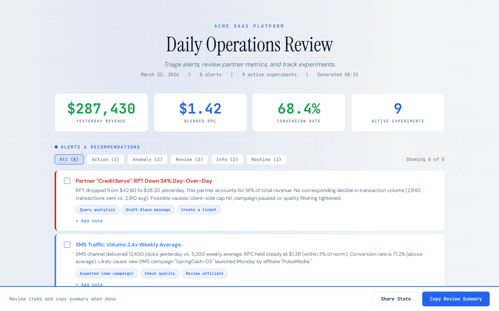
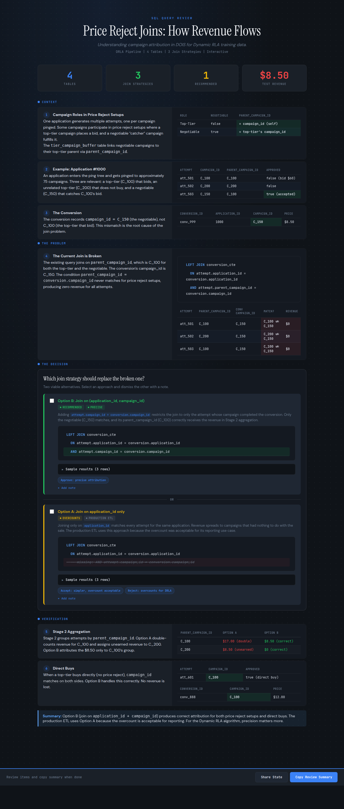
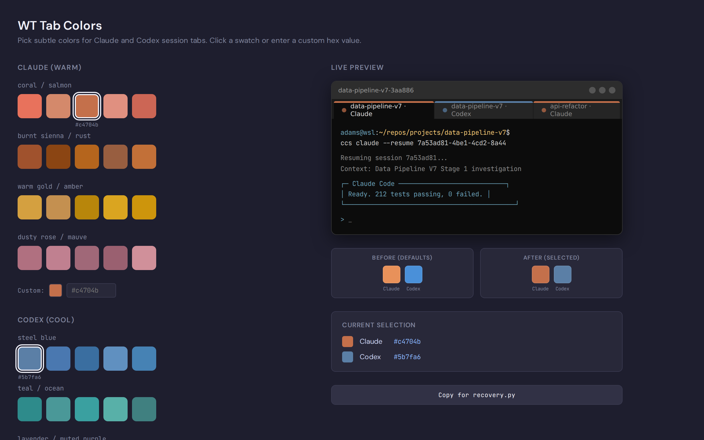

# Interactive Report Engine

Turn any review workflow into a visual, interactive HTML dashboard that Claude Code generates and you review in a browser. Click to approve, dismiss, annotate, and flag. Copy your decisions as structured markdown. Paste back into Claude. Claude executes.

No backend. No build step. No dependencies. One HTML file.

## Live Examples

- [Anniversary Trip Planner](https://docs.epcvip.vip/public/anniversary-trip-planner.html) (planning dashboard with venue comparison)
- [Config Chooser](https://docs.epcvip.vip/public/config-chooser.html) (visual config picker, standalone variant)

Requires EPCVIP login. See `examples/` for the source files.

## What It Looks Like

### Operations Dashboard
KPI cards, severity-coded alerts, collapsible data tables, quick-action pills. Click "Copy Review Summary" to export your decisions.



### SQL Query Review
Side-by-side prose and code, annotatable SQL clauses, decision groups for comparing query strategies, sample data tables with color-coded match results.



### Config Chooser
Visual picker with live preview and structured code output. A standalone variant that uses the same generate-review-feedback pattern without the engine template.



## How It Works

```
You describe the domain    Claude generates HTML    You review in browser    Paste decisions back
         |                        |                        |                        |
   "Review today's         Reads template,          Dismiss, approve,        Claude parses
    partner alerts"        fills in your data        annotate, flag          structured markdown
                                                                            and executes
```

**The feedback loop is the key.** Every click you make in the browser produces a structured markdown section when you hit "Copy Review Summary." Claude reads the literal action text, not your interpretation of it. No ambiguity.

```markdown
### Actions Selected
- Partner "CreditAcme" alert: "Query partner volume for the last 30 days"
- Experiment "RLA-Rebid-v2": "Extend duration by 7 days"

### Dismissed (Reviewed)
- [x] API Traffic anomaly (routine)
- [x] Application funnel drop (routine) -- seasonal, Black Friday recovery

### Flagged Items
- LendingTree (partner 1234): "Post count of 87 seems high. Verify delivery rule."
```

## Quick Start

### Option 1: Use the `/action-report` Skill (Recommended)

If you have the `/action-report` skill installed in Claude Code:

```
> Generate an action report for today's partner health alerts.
> There are 3 partners with volume drops and 1 with an error spike.
```

Claude reads the template, populates it with your data, saves the HTML, and opens it.

### Option 2: Copy the Template Manually

1. Copy `interactive-report-engine.html` to a new file
2. Replace the placeholder comments with your domain content
3. Open in a browser

The CSS and JavaScript require no changes. They work for any domain.

## What You Can Do in the Browser

| Interaction | How | Feedback Output |
|-------------|-----|-----------------|
| Approve/select an action | Click a quick-action pill | `### Actions Selected` with the literal instruction |
| Dismiss an item | Click the checkbox | `### Dismissed (Reviewed)` |
| Add a note | Click "+ Add note" | `### Notes` with your text |
| Flag a table row | Click any row in a data table | `### Flagged Items` with optional note |
| Annotate any element | Click underlined text (when enabled) | `### Annotations` with your comment |
| Choose between options | Select in a decision group | Appears in Actions; dismiss others with notes |

Keyboard shortcuts: `j`/`k` navigate, `x` dismiss, `1`-`5` select action, `n` add note, `c` copy summary, `?` help.

## Feature Flags

Set on the `<body>` element to toggle behavior:

| Flag | What It Does |
|------|-------------|
| `data-multiaction` | Allow selecting multiple actions per item (default: single-select) |
| `data-annotatable` | Enable click-to-annotate on marked elements |
| `data-no-persist` | Disable localStorage (page starts fresh every load) |

## Examples

| Example | File | What It Demonstrates |
|---------|------|---------------------|
| Operations Dashboard | `examples/operations-dashboard.html` | Alert triage, KPI cards, data tables with row flagging |
| SQL Query Review | `examples/sql-query-review.html` | Literate SQL sections, annotatable clauses, decision groups, sample data |
| Anniversary Trip Planner | `examples/anniversary-trip-planner.html` | Multi-action pills, annotations, pipeline steps, venue comparison |
| Config Chooser | `examples/config-chooser.html` | Standalone visual picker (not engine-based) |

## Repository Structure

```
interactive-report-engine/
├── interactive-report-engine.html      # The template (copy and customize)
├── docs/
│   ├── pattern-guide.md               # Detailed 3-layer pattern documentation
│   ├── architecture.md                # Architecture overview
│   └── skill-design-guide.md          # Layered freedom model for skill authoring
└── examples/                          # Working examples (open in browser)
```

## For Skill Authors

The engine follows a 3-layer pattern:

1. **Prompt template** (markdown) tells Claude how to gather data, classify items, and fill in the HTML
2. **HTML template** (this engine) provides the interaction model, CSS, and JavaScript
3. **Feedback loop** (clipboard markdown) returns structured decisions to Claude for execution

See `docs/pattern-guide.md` for the full architecture and `docs/skill-design-guide.md` for guidance on building skills that use this pattern.

## License

MIT
